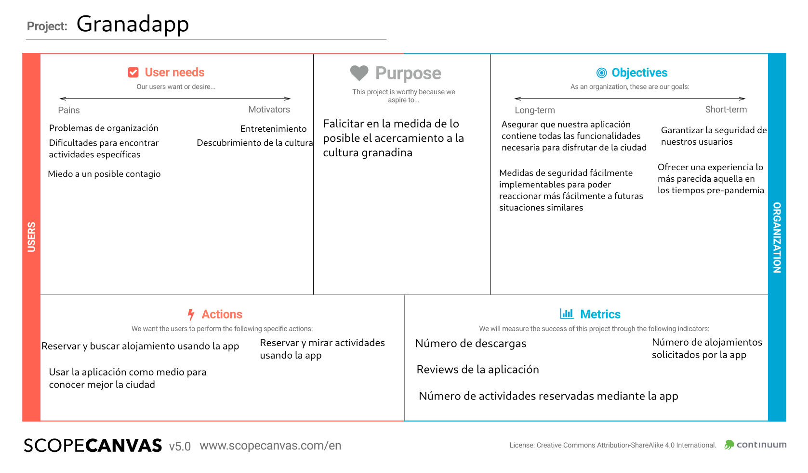

## DIU - Practica2, entregables

### Ideación
* Malla receptora de información

Se ha realizado la malla mediante las experiencias de los usuarios creado en la práctica 1, y mi propia experiencia empleando la página web/apicación de turgranada. La información se ha estructurado de la siguiente forma:

	+ *+* Ideas que nos han gustado
	+ *triángulo* Conceptos a cambiar
	+ *?* Preguntas que nos ha surgido mientras se empleaba
	+ *bombilla* Ideas para mejorar la aplicación

 1.b Grid

La propuesta de aplicación consiste en elaborar un producto de software que permita de una forma simple visitar la ciuadad de granada. Se ha tomando como inspiración la web/aplicación de turgranada. Se desea conservar todos los puntos fuertes de la misma además de incorporar algunos cambios para mejorar sus problemas.

Una de las funcionalidades nuevas es la introducción de la posibilidad de crear una cuenta de usuario para acelerar las transacciones y conservar la

Las principales funciones de mi aplicación consisten en la búsqueda de actividades y alojamiento. Con funcionalidades dedicadas a la resolución de dudas y apoyo a las anteriormente mencionadas (sistema de pago, etc...)

Cuando se inicialice la aplicación se mostrará una serie de redirecciones (alojamiento, actividaes, más información, ayuda). Además de mostrar aquellas actividades con mas popularidad en esta temporada.

La página de alojamiento mostrará hoteles, además de otros servicios de alojamiento. Se inclute también una página específica para alojamientos lgtb-friendly.

La sección de actividades muestra todas las opciones para el usuario, incluye además dos subpáginas para seleccionar aquellas que sean específicamente al aire libre y aquellas que requieran de tabajo físico (deportivas). Cada actividad incluye un pequeño resumen sobre la misma, además de la fecha y el lugar donde se realizará.

Se incluye también una página con una breve la propia ciudad. Incluyendo redirecciones a activiades relacionadas con la misma y mostrando un mapa de la ciudad con sus lugares de interés.

La sección de ayuda consiste en una página con las preguntas frecuentes y una opción de contactar con un soporte en caso de que esto no sea suficiente.

### PROPUESTA DE VALOR
* ScopeCanvas

 1.b Scope Canvas

### TASK ANALYSIS

* User Task Matrix

B. hace referencia a búsqueda, y A. hace refencia a actividades.

**B**-Baja|**M**-Media|**A**-Alta

| Grupos de Usuarios/Tareas | Extranjeros J | Extranjeros A | Extranjeros An | Locales J | Locales A | Locales An     |
|---------------------------|---------------|---------------|----------------|-----------|-----------|----------------|
| B. actividades físicas    |      A        |      M        |        B       |    A      |     M     |      B         |
| B. alojamiento            |      A        |      A        |        A       |           |           |                |
| B. alojamiento LGTBf.     |      M        |      B        |        B       |           |           |                |
| B. actividades infantiles |      B        |      A        |        B       |    B      |     A     |      B         |
| B. actividades generales  |      A        |      A        |        A       |    A      |     A     |      A         |
| B. transporte             |      M        |      A        |        A       |    B      |     B     |      B         |
| Cambiar la planificación  |      A        |      A        |        A       |    A      |     A     |      A         |
| Realización del pago      |      A        |      A        |        A       |    A      |     A     |      A         |
| Tours andando             |      A        |      A        |        B       |    A      |     A     |      B         |
| Tours en autobús/coche    |      M        |      A        |        A       |    M      |     A     |      A         |
| Creación de Usuario	    |      A        |      A        |        A       |    A      |     A     |      A         |
| Log-in                    |      A        |      A        |        A       |    A      |     A     |      A         |
| B. A en verano            |      A        |      A        |        M       |    B      |     B     |      B         |
| B. A en invierno          |      M        |      M        |        B       |    A      |     A     |      B         |
| B. A el resto del año     |      B        |      B        |        B       |    M      |     M     |      M         |

### ARQUITECTURA DE INFORMACIÓN

* Sitemap

A continuación se muestran una representación de la navegación sobre la aplicación, debido a que el diagrama ya estaba bastante saturado no se ha includido una opción para redirijir desde la página principal al perfil del ususario, pero se incluye un segundo diagrama mostrando la representación del perfil y las distintas opciones disponibles.

 1.b Diagrama Aplicación

 1.b Diagrama Perfil

Un sub-diagrama explicando más en profundidad la navegación sobre la página de actividades

 1.b Diagrama activiades

* Labelling
| Etiqueta                  | Descripción                           |
|---------------------------|---------------------------------------|
| B. actividades físicas    | Se muestran actividades físicas       |
| B. alojamiento            | Se muestran todos los alojamientos ofertados        |
| B. alojamiento LGTBf.     | Se muestran aquellos alojamientos específicamente lgtb friendly       |
| B. actividades infantiles | Se muestran actividades pensadas para niños       |
| B. actividades generales  | Se muestran todas las acividades actuales       |
| Cambiar la planificación  | Permite cambiar las actividades seleccionadas        |
| Realización del pago      | Permite pagar las actividades/alojamiento/etc...        |
| Tours andando             | Muestra aquellos tours que se realizan a pie        |
| Creación de Usuario	    | Crea un perfil de usuario        |
| Log-in                    | Se inicia sesión con una cuenta de usuario ya existente        |

### Prototipo Lo-FI Wireframe

Este es mi prototipo para la aplicación, da una idea básica de la disposición de los elementos.

 1.b Scope Canvas

### Conclusiones
(incluye valoración de esta etapa)
