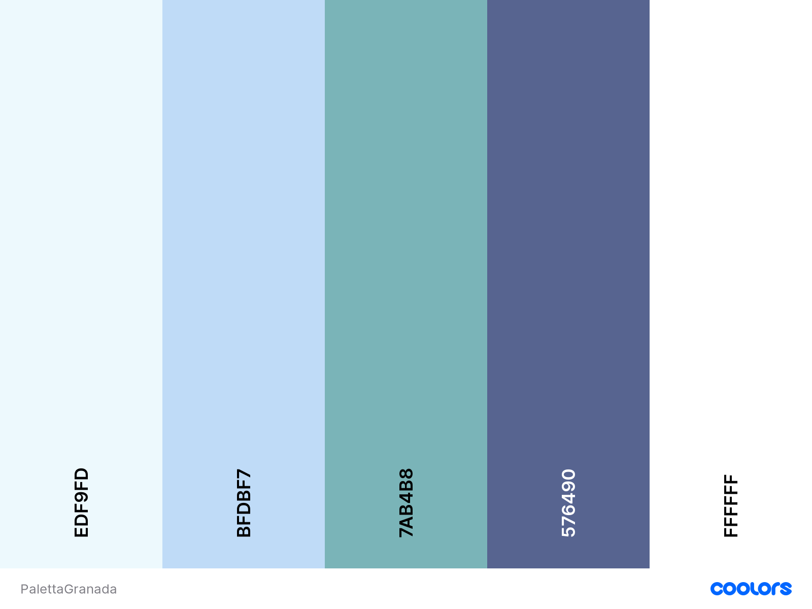
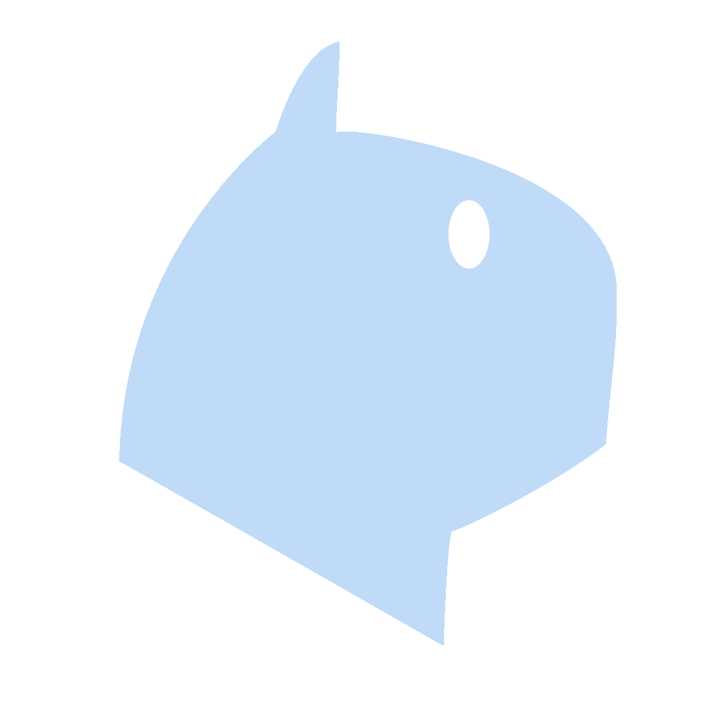
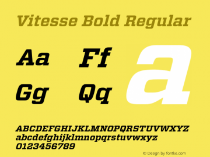
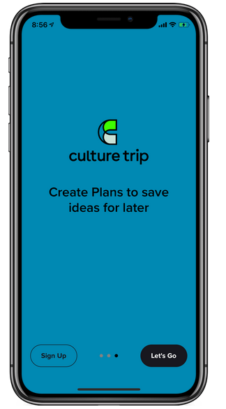
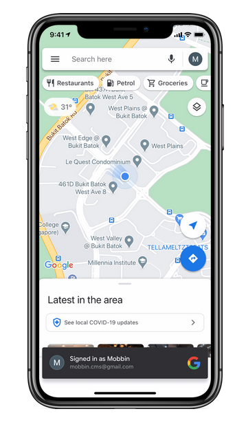

# DIU - Practica 3, entregables

## Moodboard (diseño visual + logotipo) 
A continuación se muestra la paleta de colores de la aplicación, junto con el logo de la misma.

 1.a Paleta
 1.a Logo

La fuente a utilizar sería Vietesse Bold Regular

 1.a Logo

Se ha decidido utilizar tonos de azul para la paleta de la aplicación, puesto que turgranada emplea tonos de rojo y se quiere evitar que se pueda confundir con ella.

Algunas opciones para los iconos:
<i class="fas fa-search"></i>
<i class="fas fa-sign-in-alt"></i>
<i class="fas fa-hotel"></i>

Algunas imágenes que inspiran la apariencia de la aplicación son:

 1.a Login
 1.a Map
 1.a Info

## Landing Page

## Patrones+Gudelines

Para tratar de ofrecer la mejor experiencia al usuario y elaborar una aplicación fácil de usar se van a emplear los siguientes patrones de diseño:

**Carousel**: Cuando el usuario se encuente buscando actividades o alojamiento, será necesario ofrecerle una gran cantidad de opciones entre las que elegir. Como no será posible mostrarle toda la información al mismo tiempo se empleará una selección pequeña de opciones entre las que interacturar.

Este patrón es excelente ya que la mayoría de actividades suelen tener asignadas algún tipo de cartel o iconografía, haciendo que la disposición de opciones sea puramente visual.

**Tagging** Nuestros usuarios desearán buscar actividades relacionadas con un concepto, luego hacer uso de un sistema de etiquetas facilitará comprender de qué trata una actividad y buscarla.

**Imaginery** Cuando se muestren imágenes se buscará que estas sean relevantes y suponga una funete de información al usuario. Si se están consultando rutas de senderismo, las imágenes asociadas deberán mostrar la propia ruta a la que están asociada.

## Mockup: LAYOUT HI-FI

Se ha realizado una mockup de lo que sería la página principal en web:

 1.a Landing page

## Documentación: Publicación del Case Study

Se adjunta un vídeo promocional para la aplicación

https://www.youtube.com/watch?v=2_uLMXBEW8Y

 
