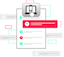

# DIU21
Prácticas Diseño Interfaces de Usuario 2020-21 (Tema: Turismo)

Grupo: DIU2_01Jmm.  Curso: 2020/21
Updated: 8/2/2021

Proyecto: JMM

Descripción: JMM

Miembros
 * :bust_in_silhouette:   Juan Mota Martínez     :octocat: JuamMM

-----

# Proceso de Diseño

## Paso 1. UX Desk Research & Analisis

 1.a Competitive Analysis
-----

Se ha elegido turgranada debido a que se trata de una la plataforma del propio ayuntamiento que se centra en viajes turísticos en la  ciudad de granada, y se ha considerado que se puede evaluar mejor la calidad de la misma debido a que al vivir en dicha ciudad se conoce  de primera mano los viajes que se está tranando de ofertar/planificar

 1.b Persona
-----

Jose Antonio, está pensado para representar un pequeño sector de personas que trabajan en la ciudad pero por diversos motivos no han podido disfrutar de la misma.

Patricia Torres, representa al conjunto de estudiantes que han tenido que mudarse a granada a estudiar y no conocen nada de la ciudad.

 1.c User Journey Map
----

No son habituales puesto que no es normal que una única persona se encarge de toda la planificación. Se ha tratado de representar como reaccionan dos personas sin experiencia organizando excursiones.

 1.d Usability Review
----

## Paso 2. UX Design

 2.a Feedback Capture Grid / EMpathy map / POV
----

### Ideación
* Malla receptora de información

Se ha realizado la malla mediante las experiencias de los usuarios creado en la práctica 1, y mi propia experiencia empleando la página web/apicación de turgranada. La información se ha estructurado de la siguiente forma:

	+ *+* Ideas que nos han gustado
	+ *triángulo* Conceptos a cambiar
	+ *?* Preguntas que nos ha surgido mientras se empleaba
	+ *bombilla* Ideas para mejorar la aplicación

 1.b Grid

La propuesta de aplicación consiste en elaborar un producto de software (granadapp) que permita de una forma simple visitar la ciudad de granada. Se ha tomando como inspiración la web/aplicación de turgranada. Se desea conservar todos los puntos fuertes de la misma además de incorporar algunos cambios para mejorar sus problemas.

Una de las funcionalidades nuevas es la introducción de la posibilidad de crear una cuenta de usuario para acelerar las transacciones y conservar los datos de transacciones previas, así como permitir al usuario consultar de una forma eficiente y sencilla las actividades que ha solicitado.

Las principales funciones de mi aplicación consisten en la búsqueda de actividades y alojamiento. Con funcionalidades dedicadas a la resolución de dudas y apoyo a las anteriormente mencionadas (sistema de pago, etc...)

Cuando se inicialice la aplicación se mostrará una serie de redirecciones (alojamiento, actividades, más información, ayuda). Además de mostrar aquellas actividades con mas popularidad en esta temporada.

La página de alojamiento mostrará hoteles, además de otros servicios de alojamiento. Se inclute también una página específica para alojamientos lgtb-friendly.

La sección de actividades muestra todas las opciones para el usuario, incluye además dos subpáginas para seleccionar aquellas que sean específicamente al aire libre y aquellas que requieran de esfuerzo físico (deportivas). Cada actividad incluye un pequeño resumen sobre la misma, además de la fecha y el lugar donde se realizará.

Se incluye también una página con una breve la propia ciudad. Incluyendo redirecciones a activiades relacionadas con la misma y mostrando un mapa de la ciudad con sus lugares de interés.

La sección de ayuda consiste en una página con las preguntas frecuentes y una opción de contactar con un soporte en caso de que esto no sea suficiente.

### PROPUESTA DE VALOR
* ScopeCanvas

 1.b Scope Canvas

### TASK ANALYSIS

* User Task Matrix

B. hace referencia a búsqueda, y A. hace refencia a actividades.

**B**-Baja|**M**-Media|**A**-Alta

| Grupos de Usuarios/Tareas | Extranjeros J | Extranjeros A | Extranjeros An | Locales J | Locales A | Locales An     |
|---------------------------|---------------|---------------|----------------|-----------|-----------|----------------|
| B. actividades físicas    |      A        |      M        |        B       |    A      |     M     |      B         |
| B. alojamiento            |      A        |      A        |        A       |           |           |                |
| B. alojamiento LGTBf.     |      M        |      B        |        B       |           |           |                |
| B. actividades infantiles |      B        |      A        |        B       |    B      |     A     |      B         |
| B. actividades generales  |      A        |      A        |        A       |    A      |     A     |      A         |
| B. transporte             |      M        |      A        |        A       |    B      |     B     |      B         |
| Cambiar la planificación  |      A        |      A        |        A       |    A      |     A     |      A         |
| Realización del pago      |      A        |      A        |        A       |    A      |     A     |      A         |
| Tours andando             |      A        |      A        |        B       |    A      |     A     |      B         |
| Tours en autobús/coche    |      M        |      A        |        A       |    M      |     A     |      A         |
| Creación de Usuario	    |      A        |      A        |        A       |    A      |     A     |      A         |
| Log-in                    |      A        |      A        |        A       |    A      |     A     |      A         |
| B. A en verano            |      A        |      A        |        M       |    B      |     B     |      B         |
| B. A en invierno          |      M        |      M        |        B       |    A      |     A     |      B         |
| B. A el resto del año     |      B        |      B        |        B       |    M      |     M     |      M         |

 2.b Tasks analysis
-----

>>> Definir "User Map" y "Task Flow" ...

A continuación se muestran una representación de la navegación sobre la aplicación, debido a que el diagrama ya estaba bastante saturado no se ha includido una opción para redirijir desde la página principal al perfil del ususario, pero se incluye un segundo diagrama mostrando la representación del perfil y las distintas opciones disponibles.

 1.b Diagrama Aplicación

 1.b Diagrama Perfil

Un sub-diagrama explicando más en profundidad la navegación sobre la página de actividades

 1.b Diagrama activiades

 2.c IA: Sitemap + Labelling
----
* Labelling
| Etiqueta                  | Descripción                                                           |
|---------------------------|-----------------------------------------------------------------------|
| B. actividades físicas    | Se muestran actividades físicas                                       |
| B. alojamiento            | Se muestran todos los alojamientos ofertados                          |
| B. alojamiento LGTBf.     | Se muestran aquellos alojamientos específicamente lgtb friendly       |
| B. actividades infantiles | Se muestran actividades pensadas para niños                           |
| B. actividades generales  | Se muestran todas las acividades actuales                             |
| Cambiar la planificación  | Permite cambiar las actividades seleccionadas                         |
| Realización del pago      | Permite pagar las actividades/alojamiento/etc...                      |
| Tours andando             | Muestra aquellos tours que se realizan a pie                          |
| Creación de Usuario	    | Crea un perfil de usuario                                             |
| Log-in                    | Se inicia sesión con una cuenta de usuario ya existente               |

 2.d Wireframes
-----

Este es mi prototipo para la aplicación, da una idea básica de la disposición de los elementos.

 1.b Scope Canvas

### Conclusiones

En resumen, se desea crear una aplicación tomando como referencia la ya existente turgranada, pero arreglando los principales fallos que se han detectado mediante las user personas y el propio uso que yo mismo he hecho de la aplicación

## Paso 3. Mi UX-Case Study (diseño)

 3.a Moodboard
-----

>>> Plantear Diseño visual con una guía de estilos visual (moodboard)
>>> Incluir Logotipo
>>> Si diseña un logotipo, explique la herramienta utilizada y la resolución empleada. ¿Puede usar esta imagen como cabecera de Twitter, por ejemplo, o necesita otra?

  3.b Landing Page
----

>>> Plantear Landing Page

 3.c Guidelines
----

>>> Estudio de Guidelines y Patrones IU a usar
>>> Tras documentarse, muestre las deciones tomadas sobre Patrones IU a usar para la fase siguiente de prototipado.

  3.d Mockup
----

>>> Layout: Mockup / prototipo HTML  (que permita simular tareas con estilo de IU seleccionado)

 3.e ¿My UX-Case Study?
-----

>>> Publicar my Case Study en Github..
>>> Documente y resuma el diseño de su producto en forma de video de 90 segundos aprox

## Paso 4. Evaluación

 4.a Caso asignado
----

>>> Breve descripción del caso asignado con enlace a  su repositorio Github

 4.b User Testing
----

>>> Seleccione 4 personas ficticias. Exprese las ideas de posibles situaciones conflictivas de esa persona en las propuestas evaluadas. Asigne dos a Caso A y 2 al caso B

| Usuarios | Sexo/Edad     | Ocupación   |  Exp.TIC    | Personalidad | Plataforma | TestA/B
| ------------- | -------- | ----------- | ----------- | -----------  | ---------- | ----
| User1's name  | H / 18   | Estudiante  | Media       | Introvertido | Web.       | A
| User2's name  | H / 18   | Estudiante  | Media       | Timido       | Web        | A
| User3's name  | M / 35   | Abogado     | Baja        | Emocional    | móvil      | B
| User4's name  | H / 18   | Estudiante  | Media       | Racional     | Web        | B

. 4.c Cuestionario SUS
----

>>> Usaremos el **Cuestionario SUS** para valorar la satisfacción de cada usuario con el diseño (A/B) realizado. Para ello usamos la [hoja de cálculo](https://github.com/mgea/DIU19/blob/master/Cuestionario%20SUS%20DIU.xlsx) para calcular resultados sigiendo las pautas para usar la escala SUS e interpretar los resultados
http://usabilitygeek.com/how-to-use-the-system-usability-scale-sus-to-evaluate-the-usability-of-your-website/)
Para más información, consultar aquí sobre la [metodología SUS](https://cui.unige.ch/isi/icle-wiki/_media/ipm:test-suschapt.pdf)

>>> Adjuntar captura de imagen con los resultados + Valoración personal

 4.d Usability Report
----

>> Añadir report de usabilidad para práctica B (la de los compañeros)

>>> Valoración personal

## Paso 5. Evaluación de Accesibilidad

  5.a Accesibility evaluation Report
----

>>> Indica qué pretendes evaluar (de accesibilidad) sobre qué APP y qué resultados has obtenido

>>> 5.a) Evaluación de la Accesibilidad (con simuladores o verificación de WACG)
>>> 5.b) Uso de simuladores de accesibilidad

>>> (uso de tabla de datos, indicar herramientas usadas)

>>> 5.c Breve resumen del estudio de accesibilidad (de práctica 1) y puntos fuertes y de mejora de los criterios de accesibilidad de tu diseño propuesto en Práctica 4.

## Conclusión final / Valoración de las prácticas

>>> (90-150 palabras) Opinión del proceso de desarrollo de diseño siguiendo metodología UX y valoración (positiva /negativa) de los resultados obtenidos

